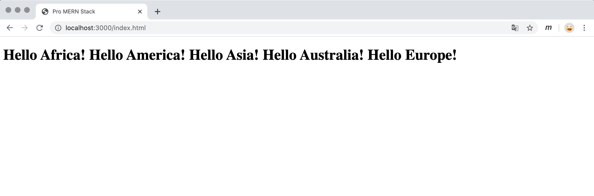

# Pro MERN Stack - 2<sup>nd</sup> Edition

## Table of Contents
- [Chapter 14 - Authentication](#chapter-14---authentication)
- [Chapter 13 - Advanced Features](#chapter-13---advanced-features)
- [Chapter 12 - Server Rendering](#chapter-12---server-rendering)
- [Chapter 11 - React-Bootstrap](#chapter-11---react-bootstrap)
- [Chapter 10 - React Forms](#chapter-10---react-forms)
- [Chapter 9 - React Router](#chapter-9---react-router)
- [Chapter 8 - Modularization and Webpack](#chapter-8---modularization-and-webpack)
- [Chapter 7 - Architecture and ESLint](#chapter-7---architecture-and-eslint)
- [Chapter 6 - MongoDB](#chapter-6---mongodb)
- [Chapter 5 - Express and GraphQL](#chapter-5---express-and-graphql)
- [Chapter 4 - React State](#chapter-4---react-state)
- [Chapter 3 - React Components](#chapter-3---react-components)
- [Chapter 2 - Hello World](#chapter-2---hello-world)
- [Troubleshooting](#troubleshooting)
- [Resources](#resources)

---

## Chapter 14 - Authentication
In this chapter, we implemented sign-in and log-out features by taking advantage of Google Sign-In. It required us to understand the concept of **cookie**, which let a user maintain the logged-in/authenticated state upon further requests and even a page refresh. Then, we added access restrictions to some GraphQL APIs by resolving the login state stored in the request's cookie prior to calling respective handlers. Additionally, we added access restrictions to some UI elements by checking a piece of information shared by React context. Later, we learned about CORS settings on the API server to enable the UI to fetch data as expected. Moreover, we achieve server rendering with credentials by passing the cookie along to requests initiated on the UI server itself.

### Notes
#### Google Sign-In
- [Instructions](https://developers.google.com/identity/sign-in/web/sign-in) on how to set it up
#### Verifying the Google Token
- "Validating a token at the back-end is required as a measure of security."
- At the back-end, we verify a user by an id token signed by Google. The unguessability of the token implies unforgeability of a user login. We use the `google-auth-library` to verify the id token.
#### JSON Web Tokens (JWT)
- Cross Site Scripting (XSS) attacks: https://owasp.org/www-community/attacks/xss/
- Comparison of cookie storage methods:

- Use the `jsonwebtoken` library and `cookie-parser` to realize cookies generation:
    - `jwt.sign(info, JWT_SECRET)` to create a cookie token encrypted with JWT_SECRET.
    - `jwt.verify(token, JWT_SECRET)` to verify/decrypt a cookie token.
    - Use `res.cookie(name, token, options)` to set a cookie in the browser.
    - Use `res.clearCookie(name)` to remove a cookie from the browser.
#### React context
- We can share data with React components on a global scope by creating contexts. 
- Create a context with `React.createContext(defaultValues)`.
- Wrap a component within `<CustomContext.Provider value={data}>` so that all descendent components have access to the context. 
- Within the component, context can be accessed with `this.context`.
#### Server Rendering with Credentials
- When a request is sent to the UI server for rendering, the request object contains the cookie of that page. The UI server then passes along the cookie information to fetch data from the api server.

---

## Chapter 13 - Advanced Features
In this chapter, we first create `withToast` which abstracts out duplicated logic in components which required a Toast. It is essentially a decorator that augments the composed component with a Toast. We then implement the report page, the data of which are generated from MongoDB aggregate api. In addition, we add some common features that will make the issue tracker more user-friendly. Specifically, we add pagination for issue list, an UNDO button for the destructive delete operation, and a search bar letting users query issues from a text index composed of titles and descriptions. This chapter is fruitful as we easily added many features in our carefully-built skeleton of MERN stack by following the book.


### To Run the Application
1. Run the API server from a command line
    ```shell script
    $ cd api/
    $ mongo issuetracker scripts/init.mongo.js
    $ mongo issuetracker scripts/generate_data.mongo.js
    $ npm install
    $ npm start
    ```
2. Run the UI server from another command line
    ```shell script
    $ cd ui/
    $ npm install
    $ npm run compile
    $ npm start
    ```
3. Access http://localhost:8000
### Notes
#### Higher Order Component for Toast
- Since the logic for showing Toast is duplicated in many components. We can factor it out into a higher order component which wraps any component and a Toast. The function `withToast()` takes in any component and returns an augmented component.
#### MongoDB Aggregate
- The collection method `db.<collection>.aggregate()` summarizes and performs many read tasks on the collection using a pipeline. It takes in an array of objects/stages which specify how to filter and aggregate data.
    ```js
    // 1. A match stage example:
    db.issues.aggregate([ { $match: { status: 'New' } } ])
    // 2. A group stage example:
    db.issues.aggregate([
      {
        $group: { // A specification of how the aggregated documents shall be created
          _id: '$owner',
          total_effort: { $sum: '$effort' },
          average_effort: { $avg: '$effort' },
        }
      }
    ])
    // 3. When an entire collection needs to be grouped into a single value,
    // we can specify the _id field to null as a convention.
    db.issues.aggregate([ { $group: { _id: null, count: { $sum: 1 } } } ])
    // Two ways to count:
    // - i. 
    db.issues.aggregate([
      { $match: { status: 'New' } },
      { $group: { _id: null, count: { $sum: 1 } } },
    ])
    // - ii.
    db.issues.count({ status: 'New' })
    // 4. A composite _id, more than one property is used to group documents.
    db.issues.aggregate([
      {
        $group: {
          _id: { owner: '$owner', status: '$status' },
          count: { $sum: 1 },
        }
      } 
    ])
    ```
#### Report Page
- The syntax `<>...</>`is a JSX shortcut for `<React.Fragment>`
- JS `Array.reduce()` example: `let a = [1,2,3,4,5]; a.reduce((acc, elm) => (acc + elm), 0);`
#### List API with Pagination
- A mongoDB cursor provides APIs to skip to an offset and limit the number of documents returned. It also has an async `count()` API which tells us the quantity of matched docs. The `count` function take in a boolean where it accounts for the `skip()` and `offset()` when it's true, or it counts all matched docs otherwise.
    ```js
    const PAGE_SIZE = 10;
    const totalCount = await cursor.count(false);
    const pages = Math.ceil(totalCount / PAGE_SIZE);
    ```
#### Pagination Performance
- There is a performance concern with regard to how we counted the number of matched records using the cursor API. Additionally, `skip()` can also be an expansive operation if we have millions of records while we intend to get to the last page. The solutions are we can simply not provide the number of matches but just provide prev and next links.
#### MongoDB Text Index API
```js
// To create an index:
db.issues.createIndex({ title: "text" })
// To query with some keywords:
db.issues.find({ $text: {$search: "click"} })
// To find all existing indexes on a collection:
db.issues.getIndexes()
// To drop an index:
db.issues.dropIndex('title_text')
// To create an index of many fields:
db.issues.createIndex({ title: "text", description: "text" })
```

---

## Chapter 12 - Server Rendering
This chapter exclusively focuses on server-side rendering (SSR). Its purpose is to make our site search-engine-friendly. The UI server takes care of the construction of requested pages, the data of which are also fetched and populated. It's important we pass along the fetched data to the browser as well because when we hydrate (attach event handlers) the pages, the browser generated DOM needs to be identical to the DOM of the server-rendered HTML. Importantly, we need to realize both server rendering and browser rendering are used.  

### Notes
#### New Directory Structure
- An .eslintrc should also be present in each subdirectory. 
- The .eslintrc from child directory would inherit what's defined from the parent.
#### Basic Server Rendering
- The UI server constructs the HTML code of the requested page for browsers to display directly.  

#### Webpack for the Server
- Now, the UI server is responsible for returning complete pages directly, so the server somewhere handles/includes the JSX code. However, we need to compile JSX intto JS as Node doesn't handle JSX. Moreover, the import/export module system differs between the UI and the server code. Fortunately, we don't have to deal with all these thanks to Webpack. We can use Webpack to bundle and compile the UI server code to be suitable for running in Node.  
#### Server Router
- On the server, we can use a `<StaticRouter>` to wrap around `<Switch>` in order to allow routing to work as in the browser where we used a `<BrowserRouter>`. 
    ```js
    function render(req, res) {
        const element = (
            <StaticRouter location={req.url} context={{}}> 
              <Page />
            </StaticRouter>
        );
        const body = ReactDOMServer.renderToString(element);
        res.send(template(body)); 
    }
    ```
#### Hydrate
- So far, the server-rendered About page contains only HTML, which means event handlers are not attached due to the absence of React code. However, we want to preserve those behaviors. The solution to this is we can add references to the bundled scripts in the HTML. A caveat is we need to replace `ReactDOM.render()` with `ReactDOM.hydrate()` to allow event handlers to be attached.  

#### Data from API and Syncing Initial Data
- The UI server needs to fetch data from the API server. So far, the only place we used `fetch` is in graphQLFetch.js. We need to use a `fetch` from a library such that both browser and Node server can use, and that is the isomorphic-fetch library. 
- To distinguish where a JS script is running, either in a Browser or in a Node server. We can set a global variable in the webpack configuration. A use case is that environment variables shall be accessed in different places based on where the script is running.
#### Nested Components
- In routes specification, we can make a parameter optional by appending a question mark after the parameter (ie. `path: '/issues/:id?'`). 
- GraphQL multiple named queries and conditionals with the `@include` directive.
    ```js
        const query = `query issueList( ...
          $hasSelection: Boolean!
          $selectedId: Int!
        ) { 
          issueList(
            ...
          }
          issue(id: $selectedId) @include (if : $hasSelection) {
            id description
          }
        }`;
    ```
#### Redirects
- In order for the `<StaticRouter>` to capture a redirect, we can specify the `context` property within it. In case of a redirect, the `context.url` will be set to the redirected url.

---

## Chapter 11 - React-Bootstrap
In this chapter, we decorated our application to make it more user-friendly and professional looking. Thanks to the `react-bootstrap` module, the task of beautifying our website becomes almost declarative. We didn't put much effort to write custom CSS as we replaced our generic components with many ready-made components such as, `Form`, `ControlLabel`, `Modal`, `Alert` and etc, the styles of which meet our requirements. We also used the `Grid` system to make our site responsive to different screen sizes. In addition, before we included the bootstrap css library in our [index.html](https://github.ccs.neu.edu/NEU-CS5610-SU20/ZerunTian-Book/blob/3f220fe1997b4eb50b652b33e0dff0dd2b24720a/ui/public/index.html#L6), we first had created a [symbolic link](https://github.ccs.neu.edu/NEU-CS5610-SU20/ZerunTian-Book/blob/master/ui/public/bootstrap) to the bootstrap library from node_modules in the public directory.

### Notes
#### Bootstrap
- To add a symbolic link to the Bootstrap distribution under the public directory: `$ ln -s ../node_modules/bootstrap/dist public/bootstrap`
- After adding the symbolic link or directly copying the dist folder to the public directory, we can reference the css file like this:`<link rel="stylesheet" href="/bootstrap/css/bootstrap.min.css">`
- Documentation: the `react-bootstrap` [module](https://react-bootstrap.github.io/getting-started/introduction), bootstrap [docs](https://getbootstrap.com/docs/3.3/)
#### Navigation Bar
- We used `<LinkContainer>` from the `react-router-bootstrap` module because it breaks the impasse of no ideal solution to linking with existing tools. The general structure looks like this:
    ```jsx
    <Nav>
      <LinkContainer exact to="/">
        <NavItem>Home</NavItem>
      </LinkContainer>
      <LinkContainer to="/issues">
        <NavItem>Issue List</NavItem>
      </LinkContainer>
    </Nav>
    ```
#### Bootstrap Grid System
- The horizontal space (a row) is divided into 12 columns. The cells wrap if there are more than 12 column-space cells within a row. 
- The width allocation for different screen size can be controlled with properties:
    - `xs`: extra small (mobile phones)
    - `sm`: small (tablet in landscape mode)
    - `md`: middle (laptops)
    - `lg`: large (desktops)
- The grid system will use the same ratio for bigger screen widths.
    ```jsx
    <Grid fluid>
      <Row>
        <Col xs={6}>...</Col>
        <Col xs={4}>...</Col>
        <Col xs={2}>...</Col>
      </Row>
    </Grid>
    ```
#### Bootstrap Forms
- A custom input component can be used by specifying the `componentClass` property.
    ```jsx
    <FormGroup>
      <ControlLable>Owner:</ControlLable>
      <FormControl
        componentClass={TextInput}
        name="owner"
        value={owner}
        ...
      />
    </FormGroup>
    ```
#### Bootstrap Modal Window
- We can create a modal window with the `<Model>` component:
```jsx
<Modal>
  <Modal.Header>
    ...
  </Modal.Header>
  <Modal.Body>
    ...
  </Modal.Body>
  <Modal.Footer>
    ...
  </Modal.Footer>
</Modal>
```
#### General
- To let a mobile browser know how to handle small screens, we can add a meta tag in the main page: `<meta name="viewport" content="width=device-width, initial-scale=1.0">`

---

## Chapter 10 - React Forms
In this chapter, we completed CRUD operations around the issues data. On the back-end, we modified the graphql schema and added necessary APIs to enable those operations. On the front-end, we mainly implemented a form for users to edit issues. We designed specialized input components to validate user inputs. This process reinforced our full-stack development skills with MERN.


### Notes
#### Controlled Component in Forms
- Controlled component: a component whose value is controlled by its parent via a state variable or props.
- Uncontrolled component: a component whose value is managed by itself.
- A component with null value signals to React that it's uncontrolled, so a controlled component must have a non-null value.
- React enforces a unidirectional data flow where data only flows from the logic layer to the view layer. Input changes in the view layer wouldn't directly sync up the corresponding state variable in the logic layer.
- React state update:
    - Avoid using values in this.state while updating the state.
    - Use the spread operator `...` to upack an object.
    - Override whatever field in the object using `{ ...obj, [key]: value }`
    ```js
    onChange(event) {
      const { name, value } = event.target;
      this.setState(prevState => ({
        issue: { ...prevState.issue, [name]: value },
      }));
    }
    ```
#### The `...` Operator
- `...` is either a spread operator, or a rest operator based on how it's used.
- If `...` appears on the LHS of an assignment, it is a rest operator. 
- If `...` appears on the RHS of an assignment, it is a spread operator.
#### Specialized Input Components   
Goal: build minimalistic components that handles non-string inputs well, adding validations to those inputs.
- When a specialized component fails to update its value accordingly, we can add a `key` property to that component so that React forces a rendering upon `key` changes. e.x. `<NumInput name="effort" value={effort} onChange={this.onChange} key={id} />`
#### Delete Issue
- We want to move a deleted issue to another collection which is responsible for maintaining recently deleted issues, so that we have a chance to recover it at a later point.
- Notice `delete` is a reserved keyword in JS, we need to name the function to something like `remove`.
#### JS Array Manipulation
- The [`splice(start, deleteCount)`](https://developer.mozilla.org/en-US/docs/Web/JavaScript/Reference/Global_Objects/Array/splice) method changes the contents of an array by removing or replacing existing elements and/or adding new elements in place.
    ```js
    const months = ['Jan', 'March', 'May', 'June'];
    // remove an existing element:
    months.splice(3, 1); // ['Jan', 'March', 'May']
    // add an element:
    months.splice(1, 0, 'Feb'); // ['Jan', 'Feb', 'March', 'May']
    // replace an element:
    months.splice(3, 1, 'April'); // ['Jan', 'Feb', 'March', 'April']
    ```
### Errors
#### Unexpected token '<'
- Steps to reproduce: 
    - Directly access any url whose path is one level down from the root (i.e. http://localhost:8000/issues/1)
    - Page becomes blank, and browser complains "Unexpected token '<'" for the required .js files.
- Troubleshoot:
    - Issue: `<script src="./env.js"></script>` (Notice the dot)
    - Fix: `<script src="/env.js"></script>`
    - When include a js as a dependency using a relative path, be careful using a path relative to the current directory. This is because when we are in `/issues/1`, the current directory is `/issues` which may not contain the necessary js files.

---

## Chapter 9 - React Router
In this chapter, we learned about routing in React. This is, in part, what makes SPA possible in a React front-end, and making URL in sync with the page content. It involves the concepts of `<Switch>`, `<Route>`, `<Link>` and etc. We had a chance to implement both hash-based routing and browser history-based routing. Their major difference lies on how an URL is built for routing, resulting in different levels of friendliness with search engine crawlers.

### Notes
#### Simple Routing
- `<Switch>` makes sure that only the first match is rendered. If we replace it with `<div>`, all matched components will be rendered.
- The `exact` property ensures exact path matching.
- An example of switch and route:
    ```jsx
    <Switch>
      <Redirect exact from="/" to="/issues" />
      <Route path="/issues" component={IssueList} />
      <Route path="/report" component={IssueReport} />
      <Route component={NotFound} />
    </Switch>
    ```
#### Route Parameters
- We can specify parameters in the route by adding `:` in front of the name of the property.
- The route parameters are stored in the `props.match.params` object.
- An example of route parameters: `<Route path="/edit/:id" component={IssueEdit} />`
#### Query Parameters
- Query parameters are the specifications after the `?` of an url.
- They are available in the `const { location: { search } } = this.props;`.
- We can wrap the raw query string in `new URLSearchParams(search)` to get values conveniently.
- An example of query parameters: `https://localhost:8000/#/issues?status=New`
#### Links
- A React way of creating hyperlinks: `<Link>` and `<NavLink>`.
- The paths in a Link are always absolute.
- The `to` property can either be a string or an object containing a path and query variables. 
- An example of Link:
```jsx
<div>
  <Link to="/issues">All Issues</Link>
  {' | '}
  <Link to={{ pathname: '/issues', search: '?status=New' }}>
    New Issues
  </Link>
  {' | '}
  <Link to={{ pathname: '/issues', search: '?status=Assigned' }}>
    Assigned Issues
  </Link>
</div>
```
#### Nested Routes
- We can create a secondary dynamic content using a nested route on the secondary component.
- An example of nested route:
```jsx
// The top level Switch component
<Switch>
  ...
  <Route path="/issues" component={IssueList} />
  ...
</Switch>
// IssueList component
<React.Fragment>
  ...
  <Route path={`${match.path}/:id`} component={IssueDetail} />
  ...
</React.Fragment>
```
#### Browser History Router
- Previously, we used a `HashRouter`, which assumes that path is always at `/`, and routing is based on the **anchor** part (e.g. `/#/issues`). The downside is that it's not search engine friendly, as a crawler would assume `/#/issues/1` is just some anchor on the same page as `/`, thus no new requests would have been made. Alternatively, we explored the `BrowserRouter`, which uses different URL base for different routes (e.g. `/issues`). In this case, the crawler would have made a new request to `/issues/1`.
- Specifying the `output.publicPath` field to `/` in webpack.config.js is necessary when use a browser router for HMR to work as expected. This is because HMR uses the `publicPath` location to fetch update information for modules. Say, we are making changes to the `IssueEdit` component at `/edit/:id`. By default, `output.publicPath` is set to an empty string, so HMR would make a request to the **current** location --- `/edit/`. Our HMR middlerware won't handle such request. By overriding `publicPath` to `/`, HMR would make a request to `/`, and the middleware would handle and respond to this request.
#### General
- There are two kinds of routing: hash-based and browser history-based.
- Server-side rendering enables search engine crawlers to index SPA page content.
- Any change in a parent component will trigger a render in the child. This is because the parent's state can affect the child in most cases. However, this won't raise a performance problem to a level we should concern thanks to the virtual DOM.
- A component wrapped by `<Route>` has `history`, `location`, and `match` available in props of the component. However, a component not directly wrapped by `<Route>` will need to be wrapped with `withRouter()` to create a new component which has these properties available. These properties are essential to dynamically load different views.
- React Router [tutorials](https://reacttraining.com/react-router/) 
---

## Chapter 8 - Modularization and Webpack
This chapter continues the spirit of last chapter where we modularized both the backend and frontend code for better scalability and maintainability. There weren't many changes in the backend besides splitting functions in server.js to separate files. In terms of the frontend restructuring, not only did we modularized components into separate files, we used Webpack to transform and pack these files into a few bundles, which contain all the required code. This eliminates the efforts of referencing many JS files in index.html. During development, we can take advantage of the Hot Module Replacement feature of Webpack to automatically sends the latest UI updates to our browser. In addition, we learned about configuring source maps in the webpack config, which is valuable in debugging.

### Notes
#### The Module system (import and export)
- The NodeJS way: 
    - Two key elements to interact with the module system: `require` and `exports`.
    - `const symbols = require(<module>)` where `module` is either the module name for a package installed via npm, or the path to a module of our own.
    - `module.exports` - a global variable to be set to indicate which symbols can be imported by other modules. In other words, whatever was assigned to `module.exports` is the value that a call to `require()` returns.
- The latest ES6 way:
    - `import <variable> from '<path-to-module>'`
    - `export` put before the definition of whatever is being exported.
    - `export default` if a single function is being exported as a top-level export.
#### Front-End Modules and Webpack
- Webpack: 
    - It watches, transforms, and bundles JavaScript files into a single file.
    - It has two modes: `development` and `production` specified with the `--mode` flag.
    - It cannot handle .jsx files natively. Thus, we need to transpile our source code first with the help of `babel-loader`.
    - It can be configured to pack libraries in node_modules as a separate bundle apart from the application modules bundle for performance reasons. As a result, code changes in the application module won't trigger a rebuild of the bundle consisted of third-party libraries. 
    - An example webpack configuration: [webpack.config.js](https://github.ccs.neu.edu/NEU-CS5610-SU20/ZerunTian-Book/blob/master/ui/webpack.config.js)
    - The [`optimization.splitChunks`](https://github.ccs.neu.edu/NEU-CS5610-SU20/ZerunTian-Book/blob/dc2b114fb9e4f01ad88531b6775cbce3601a1615/ui/webpack.config.js#L20) plugin separates everything under node_modules into a different bundle.
    - Add `devtool: 'source-map'` to the config to facilitate debugging in browsers' debuggers.
    - Hot Module Replacement: it changes modules in the browser while the application is running, so it saved us time in manually refreshing the page to get the latest updates.
    - Webpack docs: [code splitting](https://webpack.js.org/guides/code-splitting/), [lazy-loading](https://webpack.js.org/guides/lazy-loading/), and [more](https://webpack.js.org/guides/).
- Starting the UI server:
    - option 1: `npm run compile` + `npm run start` (use this in `prod` mode)
    - option 2: `npm run start` (use this in `dev` mode where HMR is enabled)
    - option 3: `npm run watch` + `npm run start` (use this in `prod` or `dev` mode)

---

## Chapter 7 - Architecture and ESLint
This chapter redesigns the architecture of our application to be scalable and performant to accommodate more features and requirements. Specifically, we separated the UI and the API server. Since the UI server is running on an origin different from the API endpoint, we investigated the Same Origin Policy and the Cross-site Resource Sharing. Alternatively, we added a proxy on the UI server, delegating requests on `/graphql` to the API server. In addition, we replaced hard-coded settings with environment variables that can be read at runtime. In the second part, we sanitized the code according to the linting rules. Moreover, we added an example of props validation using prop-types.js loaded from a cdn.

#### Notes:
- Server architecture redesigned (Single server => UI server + API server):

- [Same Origin Policy](https://www.netsparker.com/whitepaper-same-origin-policy/#SameOriginPolicyinDetail): 
    - origin = scheme + host + port
    - one origin can always send requests to another origin
    - one origin can load resources but may not reach their source code from another origin
- Proxy-based architecture: UI server routes `/graphql` requests to the proxy, which targets to the API server

- We could specify files and folder in `.eslintignore` to keep them from being linted. 
- PropTypes: check props against a specification. `<component>.propTypes = { propertyName: validator }`

---

## Chapter 6 - MongoDB
In this chapter, we replaced a state variable on the server with a real database to persist data. We learned to interact with data stored in the MongoDB server through a mongo shell, which is an interactive JavaScript interface to MongoDB. We automated the creation of a clean database by writing a script that contains the necessary commands. I need to spend some more time in familiarizing those CRUD APIs. In addition, dealing with function calls to the database refreshed my memory on writing asynchronous functions. 

#### Notes
- MongoDB:
    - A record is called a document, or an object.
    - A collection is a set of documents, which have mandated primary keys through the field `_id` of type ObjectId.
    - The concept of database here is a logical partitioning namespace.
    - It does not enforce a schema for any collection by default. 
    - The mongo shell is built on top of a JavaScript engine, so not only is it an interactive shell, it is also a scripting environment.
- CRUD APIs:
    - Create: 
        - `db.<collection>.insertOne(object)`
        - `db.<collection>.insertMany([object])`
    - Read:
        - `db.<collection>.find({<field>: {operator: value}}, {<field>: <0/1>})` // find(query, projection) => cursor
        - `db.<collection>.findOne(query, projection)` // returns an object
        - `db.<collection>.createIndex()` // When filtering on a field is a common occurrence, it's a good idea to create an index for the field so that MongoDB can just use the index (potentially an inverted index where keys are the field value itself) instead of scanning through all documents in the collection.
    - Update:
        - `db.<collection>.updateOne(query, updateSpec)`
        - `db.<collection>.updateMany(query, updateSpec)`
        - `db.<collection>.replaceOne(query, object)` // replace a whole document
    - Delete:
        - `db.<collection>.deleteOne(query)`
    - Aggregate:
        - `db.<collection>.aggregate([aggregateSpec])` // `aggregate()` method works in a pipeline. Every stage in the pipeline takes the input from the result of the previous stage.
- `mongo` command launches a mongo shell client. `mongod` launches a MongoDB server.

---

## Chapter 5 - Express and GraphQL
In this chapter, we built APIs that enabled CREATE and READ operations on the server. Building GraphQL APIs involved writing a schema that specifies `Query` and `Mutation` fields along with custom types, creating corresponding resolvers that respond to requests, and using the Apollo server as an add-on to the Express server. We could have built those APIs using REST, but we were recommended to use GraphQL for its features and flexibility brought by its query language. As we moved the storage of *issues* to the server, we could refresh the page without worrying about losing recently added *issues*. Next, we implemented input data validation and error reporting.

#### Notes
- A **route** specification consists of three parts:
    - an HTTP method (GET, POST, etc.)
    - a path specification that matches the request URI
    - a route handler function
- When Express receives a request, it matches the request to one of the routes based on the request's method and the request URL.
- Route parameters: named segments in the path specification that matches a part of the URL. e.x. `app.get('/users/:userId', ...)` matches `/users/1234` and the value 1234 will be stored in `req.params.userId`.
- Remember that the router does not try to find the best match. If more than one routes match a URL, the *first* defined one is used. Hence, define routes in order of priority or, in other words, specific to generic.
- Once a route is matched, the handler function is called with the request object and response object.
- What is in the request `req` object? Look [Express Request](http://expressjs.com/en/api.html#req) and maybe Node.js' [request object](https://nodejs.org/api/http.html#http_class_http_incomingmessage), from which the Express request is extended.
- What is in the response `res` object? Look [Express Response](http://expressjs.com/en/api.html#res) and maybe Node.js'[response object](https://nodejs.org/api/http.html#http_class_http_serverresponse).
- Middleware vs. Route: 
    - a middleware works on generic handling of requests that need to be done for all or most requests. It's analogous to a doorman. It has reference to the next middleware. Third-party middleware is available via npm.
    - a route is meant to be used for a specific path+method combination and is expected to send out a response.
- REST is an architectural pattern for APIs, that is resource-based, exposing data through URL endpoints. However, we don't have a granular control and aggregation of resources using REST.
- GraphQL:
    - A GraphQL API server have a *single* endpoint to respond all requests.
    - Works with a strongly typed query language.
    - Basic data types: `Int`, `Float`, `String`, `Boolean`, and `ID`.
    - Gives us more control over what the server returns.
    - A handler mapped to a field is called a **resolver**. All resolver function are supplied four arguments.
- Custom scalar type can be helpful when we want to customize how a field should be handled. 
    - e.x. the `GraphQLDate` scalar type
    - Use the `GraphQLScalarType` class to create a resolver for the custom scalar type.
        - Override `serialize(value)`; `parseValue(value)` for query variables; `parseLiteral(ast)` for variables directly in query string to customize data processing.
- `Query` and the `Mutation`types are entry points for GraphQL APIs.
- CRUD Mapping for HTTP Methods:

- Query Variables (preferred) vs. Raw Query:


#### Errors
- Server failed to start due to the following error:
    - 
    - Solution: The error went away after upgrading graphql to 14.6.0. [[ref]](https://stackoverflow.com/questions/61639636/cannot-find-module-graphql-validation-rules-possibletypeextensions)
---

## Chapter 4 - React State
This chapter introduced how to use state to update the UI upon user interactions. Now, we have a form which allows us to enter a new issue which will be appended to the end of the issue table. It required us to lift the state up from `IssueTable` to `IssueList` which is the parent component of both `IssueTable` and `IssueAdd`. A callback function `createIssue()` defined in `IssueList` is passed down to `IssueAdd` through props. A call to the callback is triggered whenever `IssueAdd` receives a new issue. Moreover, we simplified some simple/**stateless** components to function components for performance.
  
#### Notes
- Properties in `this.props` are immutable.
- React detects changes in `this.state` to update the view. We shouldn't rely on setting or mutating the `state` variable to update the UI. This is because React is not able to detect such changes in a plain JS variable, thus nothing will rerender. The right way to inform React is by calling `this.setState()`.
- `state` should store data that would affect the DOM.
- The `constructor()` is not a good place to fetch data because components relying on the data might not have been rendered.
- *Lifecycle methods* let us do things depending on the stage or changes in the status of components.  
    - `componentDidMount()`: (best place to init the loading of data) this method is called immediately after the initial render of components. 
    - `componentDidUpdate()`: this method is called immediately after an update (excluding the initial render). Previous props and state are passed as well. 
    - `componentWillUnmount()`: this method is useful for cleanup such as cancelling timers and pending requests.
- At this point, it's convincing that React is declarative because the UI is updated after methods calls like `setState()` without us manipulating the DOM explicitly.   
- Specify binding in the constructor of the parent class when a method is passed down to a child component where it gets called. e.x. `this.calledByChildren = this.calledByChildren.bind(this);`
- Use `event.preventDefault()` to avoid default behaviors.
- When a component is simply representing UI without state and event handling, consider using a function component over class component.
- Lifting state up to the closest common ancestor of components who need to access or manipulate the data:

- State vs. Props:

- Parent and child communication:


---

## Chapter 3 - React Components
This chapter introduced React component class, which allowed us to build small components that are maintainable and reusable. We could build a complex UI out of those small components. At the end of this chapter, I was able to create a barebones version of the Issue Tracker's main page. During the process, I explored two ways of passing data from one component to the other, which increased reusability of components. Moreover, I added styles to some components through both styles object in JavaScript and the CSS styles in HTML.  
  
#### Notes
- `<React.Fragment>...</React.Fragment>` can be used to [pack](https://github.ccs.neu.edu/NEU-CS5610-SU20/ZerunTian-Book/blob/f5ad8abfcc7fae20e32c018afe41c573680e85b6/src/App.jsx#L76) multiple components as one component other than wrapping a `div` explicitly.
- To create a React component class, write a [class](https://github.ccs.neu.edu/NEU-CS5610-SU20/ZerunTian-Book/blob/f5ad8abfcc7fae20e32c018afe41c573680e85b6/src/App.jsx#L14) that inherits from the `React.Component` class.
- Although the JSX [`<div>`](https://github.ccs.neu.edu/NEU-CS5610-SU20/ZerunTian-Book/blob/f5ad8abfcc7fae20e32c018afe41c573680e85b6/src/App.jsx#L17) looks exactly like a html tag, it is an instance of the `div` React component class under the hood.
- `class` is a reserved JS keyword, so [`className`](https://github.ccs.neu.edu/NEU-CS5610-SU20/ZerunTian-Book/blob/f5ad8abfcc7fae20e32c018afe41c573680e85b6/src/App.jsx#L28) is used as a property of a component.
- Fields with dashes shall be written in camelCase.
- An unique [`key`](https://github.ccs.neu.edu/NEU-CS5610-SU20/ZerunTian-Book/blob/f5ad8abfcc7fae20e32c018afe41c573680e85b6/src/App.jsx#L25) is required for each item in a set of components of the same type for React to render them properly.
- Use ternary `<condition> ? <true-case> : <false-case>` [operator](https://github.ccs.neu.edu/NEU-CS5610-SU20/ZerunTian-Book/blob/f5ad8abfcc7fae20e32c018afe41c573680e85b6/src/App.jsx#L58) for readability.
- Example table structure: 
    ```html
    <table>
        <thead>
            <tr>
                <th>Name</th>
                <th>Age</th>
            </tr>
        </thead>
        <tbody>
            <tr>
                <td>Zerun</td>
                <td>21</td>
            </tr>
            <tr>
                <td>Victor</td>
                <td>22</td>
            </tr>
        </tbody>
    </table>
    ```
---

## Chapter 2 - Hello World
This chapter guided us to install modules required for building a hello world program. The code went through multiple iterations to achieve better separation of concerns. The end product is a local web server which serves static files. For the sake of simplicity and readability, the source code is written in JavaScript (ES6) mixed with JSX. In order for browsers to interpret it properly, Babel is used to transpile the code into App.js at build-time. The file being served by default index.html depends on App.js to populate UI components. This was my formal exposure to React, Express, and Node.     

#### Steps
- Writing JSX and transforming it into JavaScript code at runtime
- Serving an express app on localhost port `3000` and handling requests through a middleware
- Applying Babel to transform JSX and ES6 code at build-time to effectively support more browsers
- Automating Babel compilation and NodeJS server refresh  
#### Notes
- The require() function is provided by NodeJS and not supported by browsers' JavaScript.
- A `middleware` is any function that handles request and response, which needs to be [mounted](https://github.ccs.neu.edu/NEU-CS5610-SU20/ZerunTian-Book/blob/a92744414190b40eb8669fb666fb0ae0e0bc1cae/server/server.js#L9) on the app. But, not all functions receiving and responding requests are middleware. They could be route handlers.
- Thanks to npm, we can run a command with `$ npm run <script-name>` specified in the [scripts](https://github.ccs.neu.edu/NEU-CS5610-SU20/ZerunTian-Book/blob/a92744414190b40eb8669fb666fb0ae0e0bc1cae/package.json#L6) value.  
- To automate Babel transformation, run `$ npm run watch`.
- To automate server refresh upon changes in source files, run `$ npm run start`.

---

## Troubleshooting
#### MongoDB
- To start server as a daemon: `sudo mongod --config /usr/local/etc/mongod.conf --fork`  

---

## Resources
#### GraphQL
Documentation: https://graphql.org   
Apollo GraphQL tools: https://www.apollographql.com/docs/graphql-tools/
#### MongoDB
Schema validation: https://docs.mongodb.com/manual/core/schema-validation/index.html
MongoDB manual: https://docs.mongodb.com/manual/
